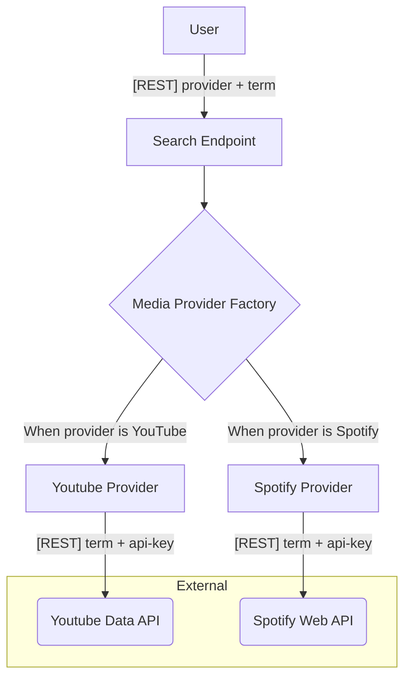

## Description

This application is responsible for searching into media providers (such as YouTube, Spotify, etc) based on query string.

This is a small part of a bigger private personal project.

## Requirements

- [Docker](https://www.docker.com/get-started)

## Development

We are using Docker with the [scripts-to-rule-them-all](https://github.com/github/scripts-to-rule-them-all) idea, so we have a set of scripts inside `script` folder that should cover all development needs:

```bash
$ script/setup    # builds application
$ script/server   # runs application
$ script/update   # keeps application up to date
$ script/test     # run tests of the application
$ script/lint     # runs lint tool on application
$ script/bash     # access bash into container
```

## Architecture

#### Application Flow


#### Application Layers (Path Organization)

- **core:** Domains and business logics decoupled from tools/frameworks.
- **infrastructure:** Infrastructure setup such as data providers, external connections and overall configuration.
- **presentation:** Entrypoint with routing, controllers and REST API framework.


## Technical Details

- Languages and runtimes: `JavaScript - TypeScript - Node.JS`;
- Backend Framework: `ExpressJS`;
- Architecture: `Backend Application - Clean Architecture - REST API`;
- Methodologies, principles and practices: `Design Patterns - Test-Driven Development (TDD) - Clean Code - SOLID - YAGNI - KISS`.

## Stay in touch

For questions or inquiries, please contact **Thauã Silveira** at [thaua@outlook.com](mailto:thaua@outlook.com).
